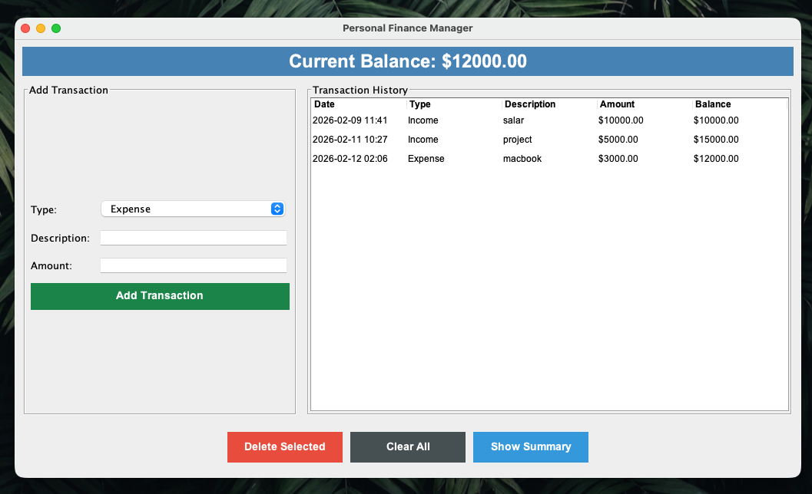
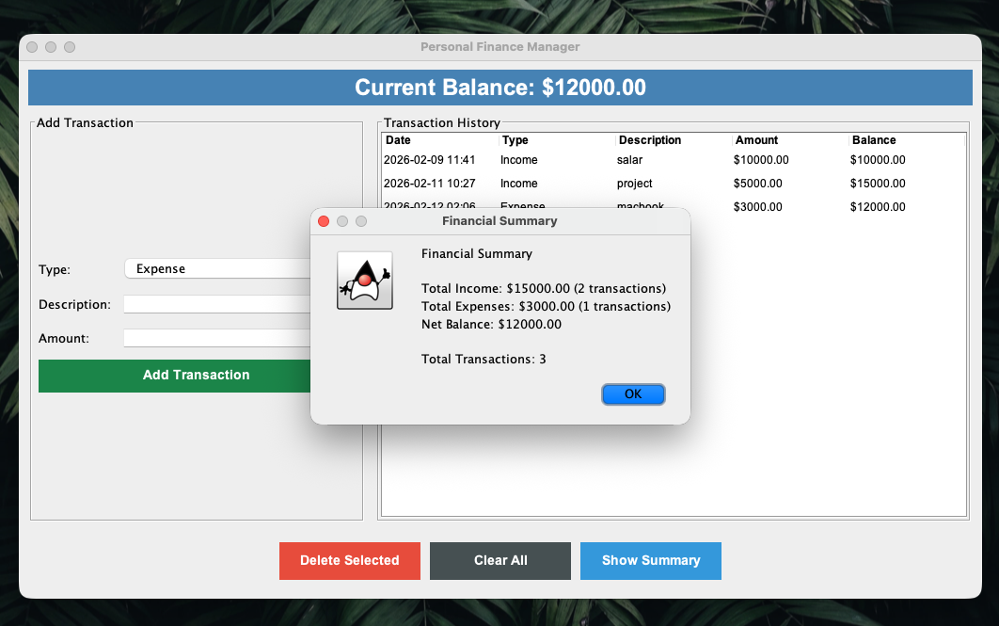
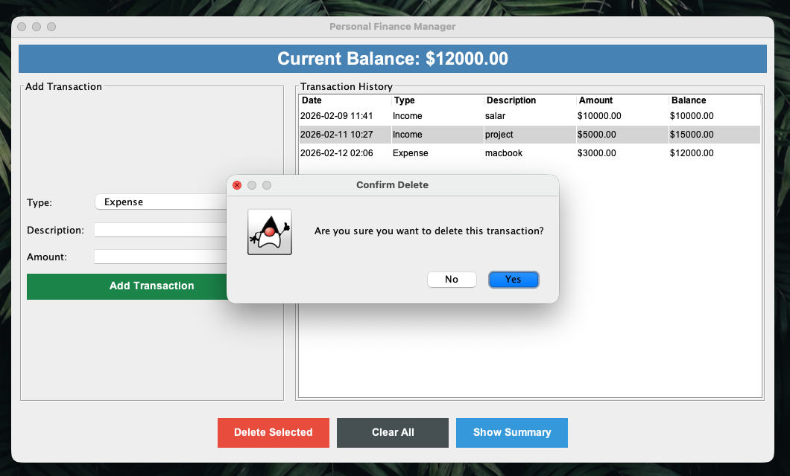
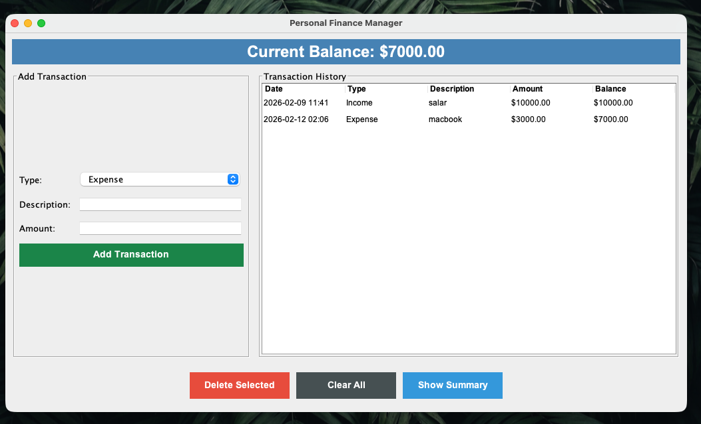
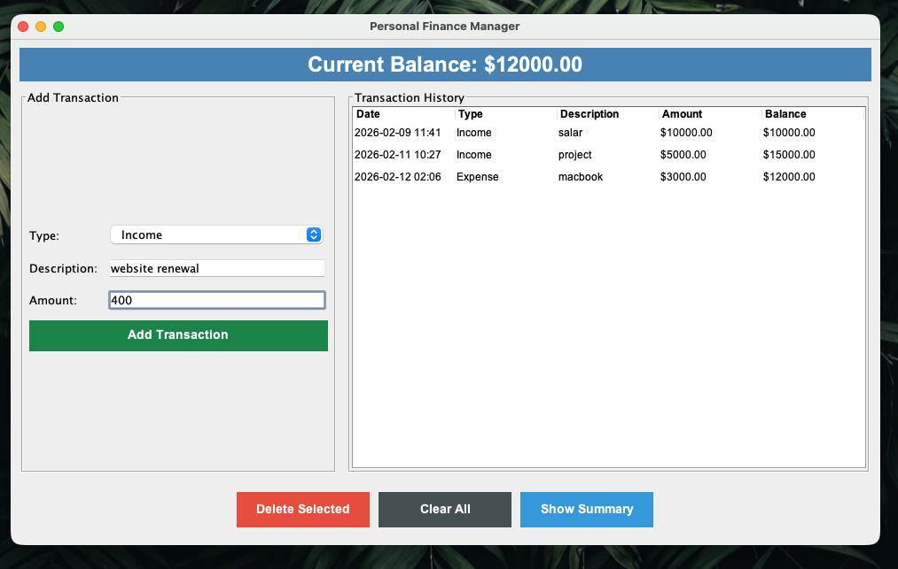
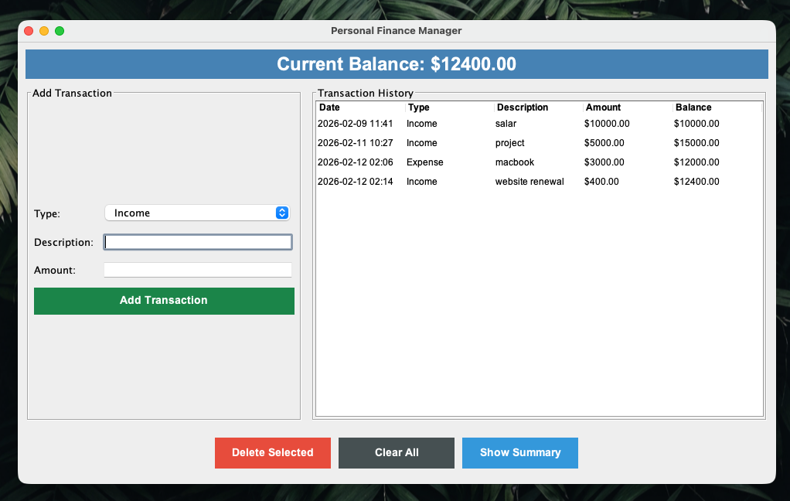

# Finance Management System

**Team Members:** Mohamed Shah & Jerit Baiju

---

## 📋 Problem Statement

Managing personal finances manually can be tedious and error-prone. Tracking income and expenses, maintaining accurate balances, and generating financial summaries requires a systematic approach. Many individuals struggle to maintain a clear overview of their financial transactions, leading to poor financial management and decision-making.

## 🎯 Objective

The **Finance Management System** aims to provide a user-friendly desktop application that enables users to:
- Record and track financial transactions (income and expenses)
- Maintain accurate real-time balance calculations
- Store transaction history persistently in a database
- Generate financial summaries for better financial insights
- Manage transactions with easy add, delete, and clear functionalities

---

## ✨ Features

### Core Functionality
- **Add Transactions**: Record income and expense transactions with description, amount, and type
- **Transaction History**: View all transactions in a tabular format with date, type, description, amount, and running balance
- **Delete Transactions**: Remove individual transactions with automatic balance recalculation
- **Clear All**: Remove all transactions from the system
- **Financial Summary**: View comprehensive statistics including:
  - Total income and expense amounts
  - Number of income and expense transactions
  - Current net balance
  - Total transaction count

### Advanced Features
- **Real-time Balance Tracking**: Automatic balance updates as transactions are added or removed
- **Database Persistence**: All transactions are stored in MySQL database for data integrity
- **User-Friendly Interface**: Clean and intuitive GUI with color-coded elements
- **Data Validation**: Input validation for transaction amounts and descriptions
- **Confirmation Dialogs**: Safety prompts before deleting transactions
- **Visual Balance Indicator**: Color-coded balance display (red for negative balance)

---

## 🛠️ Technologies Used

### Programming Language
- **Java** (openjdk 17.0.18 2026-01-20 LTS)

### GUI Framework
- **Java Swing** - For creating the graphical user interface
- **AWT** - For event handling and layout management

### Database
- **MySQL** - Relational database for persistent storage
- **JDBC** (Java Database Connectivity) - For database operations

### Libraries
- **MySQL Connector/J (8.3.0)** - MySQL JDBC driver

### Key Java Components
- `JFrame`, `JPanel`, `JTable`, `JButton`, `JTextField`, `JComboBox`
- `DefaultTableModel` - For table data management
- `SimpleDateFormat` - For date/time formatting
- `PreparedStatement` - For secure SQL operations

---

## 🚀 Steps to Run the Program

### Prerequisites
1. **Java Development Kit (JDK)** - Version 17.0.18 or higher installed
2. **MySQL Server** - Running on localhost (default port 3306)
3. **MySQL Connector/J** - Version 8.3.0 JAR file in the project directory

### Database Setup
The application will automatically create the database and tables on first run. Default MySQL credentials:
- **Host:** localhost
- **Port:** 3306
- **Database:** finance_manager
- **Username:** root
- **Password:** (empty)

> **Note:** If your MySQL credentials are different, update the database configuration in [P1.java](P1.java) lines 20-23.

### Compilation
Open a terminal in the `fms_java` directory and compile the program:

```bash
javac P1.java
```

### Execution
Run the program with the MySQL connector in the classpath:

```bash
java -cp ".:mysql-connector-j-8.3.0.jar" P1
```
---

## 📸 Screenshots

### 1. Main Application Window

*The main interface showing the transaction history with 3 transactions loaded from the database. The top panel displays the current balance, the left panel contains input fields for adding new transactions, and the center shows the transaction table.*

### 2. Financial Summary

*Financial summary dialog displaying total income, total expenses, net balance, and transaction counts. This window is shown using `showMessageDialog`.*

### 3. Delete Confirmation

*Warning message dialog that appears when attempting to delete a transaction, ensuring the user confirms the action before deletion.*

### 4. After Deletion

*The main page after successfully deleting a transaction. The balance and transaction list are automatically updated.*

### 5. Adding a Transaction - Input

*Example of values inserted into the input fields before adding a new transaction. Shows the Type dropdown, Description field, and Amount field populated with sample data.*

### 6. Adding a Transaction - Result

*The main page after successfully adding a new transaction. The new entry appears in the transaction table with the updated balance.*

---

## 🧪 Sample Inputs and Test Cases

### Test Case 1: Adding Income Transaction
**Input:**
- Type: Income
- Description: Salary
- Amount: 5000.00

**Expected Output:**
- New row added to transaction table
- Current balance increases by $5000.00
- Transaction saved to database
- Input fields cleared

---

### Test Case 2: Adding Expense Transaction
**Input:**
- Type: Expense
- Description: Groceries
- Amount: 150.50

**Expected Output:**
- New row added to transaction table
- Current balance decreases by $150.50
- Transaction saved to database
- Input fields cleared

---

### Test Case 3: Deleting a Transaction
**Action:**
1. Select a transaction from the table
2. Click "Delete Selected" button
3. Confirm deletion in the dialog

**Expected Output:**
- Selected transaction removed from table
- Balance recalculated automatically
- All subsequent transaction balances updated
- Changes persisted to database

---

### Test Case 4: Financial Summary
**Precondition:** Multiple income and expense transactions exist

**Action:** Click "Show Summary" button

**Expected Output:**
- Dialog displays:
  - Total Income with count
  - Total Expenses with count
  - Net Balance
  - Total number of transactions

**Sample Output:**
```
Financial Summary

Total Income: $7500.00 (3 transactions)
Total Expenses: $2350.75 (5 transactions)
Net Balance: $5149.25

Total Transactions: 8
```

---

### Test Case 5: Input Validation
**Test 5a - Empty Description**
- Input: Amount = 100, Description = (empty)
- Expected: Error message "Please enter a description"

**Test 5b - Invalid Amount**
- Input: Description = "Test", Amount = "abc"
- Expected: Error message "Please enter a valid amount"

**Test 5c - Negative/Zero Amount**
- Input: Description = "Test", Amount = 0 or -50
- Expected: Error message "Amount must be greater than 0"

---

### Test Case 6: Clear All Transactions
**Action:**
1. Click "Clear All" button
2. Confirm in the dialog

**Expected Output:**
- All transactions removed from table
- Balance reset to $0.00
- Database cleared
- Confirmation required before action

---

### Test Case 7: Data Persistence
**Action:**
1. Add multiple transactions
2. Close the application
3. Restart the application

**Expected Output:**
- All previously added transactions loaded from database
- Balance correctly calculated from historical data
- Transaction order preserved

---

## 🗄️ Database Schema

### Table: `transactions`

| Column       | Type         | Description                          |
|-------------|--------------|--------------------------------------|
| id          | INT          | Auto-increment primary key           |
| date        | VARCHAR(50)  | Transaction date and time            |
| type        | VARCHAR(20)  | Transaction type (Income/Expense)    |
| description | VARCHAR(255) | Transaction description              |
| amount      | DOUBLE       | Transaction amount                   |
| balance     | DOUBLE       | Running balance after transaction    |
| created_at  | TIMESTAMP    | Record creation timestamp            |

---

## 📝 Notes

- The application automatically creates the database and table if they don't exist
- All transactions are timestamped with the current date and time
- The balance is color-coded (white for positive, red for negative)
- Transaction history is sorted by ID (chronological order)
- The application uses prepared statements to prevent SQL injection attacks

---

## 👥 Contributors

- **Mohamed Shah** - 24ubc249
- **Jerit Baiju** - 24ubc234

---

## 📄 License

This project is for educational purposes as part of academic coursework.

---

*Last Updated: February 2026*
